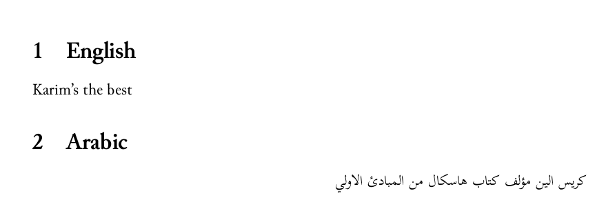

# Arabic in LuaTeX



# Installation

Ubuntu/Debian only, otherwise, figure out how to install the full texlive suite (including LuaTeX) and the font Scheherazade. I use Scheherazade because it's designed for unicode.

```
$ make deps
```

# Rendering the PDF

```
make
```
